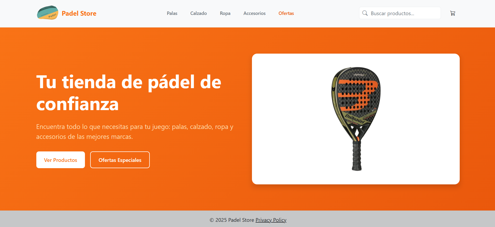
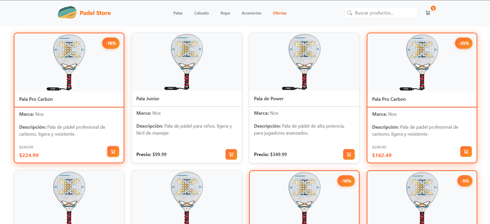
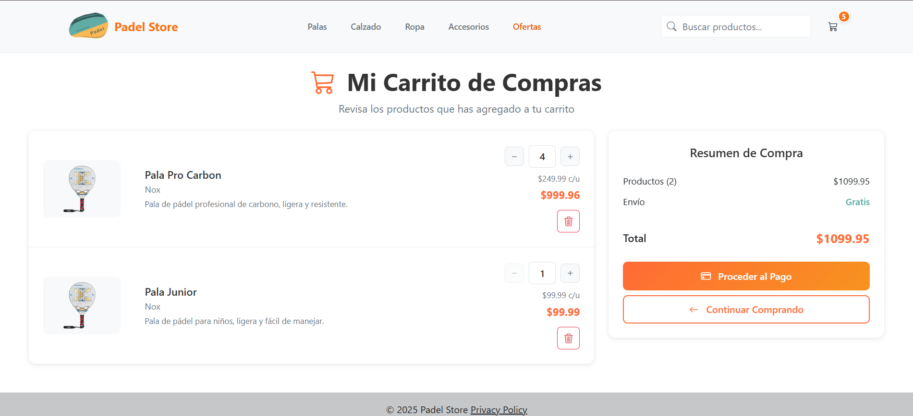
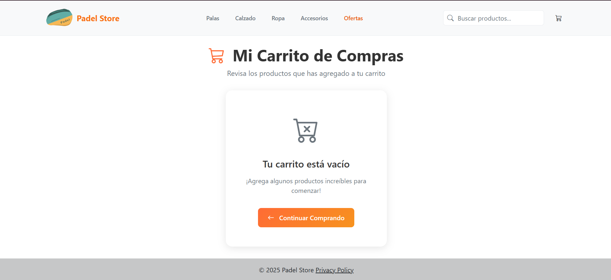

# PadelStore

Se eligió de temática una tienda de padel, en la cual se podrán encontrar diversos productos relacionados al deporte y tendrá la funcionalidad de agregar y sacar productos del carrito.

## Datos del Estudiante

- **Nombre y Apellido:** [Tu Nombre y Apellido]
- **DNI:** [Tu DNI]
- **Email:** [tu.email@ejemplo.com]
- **Sede:** [Tandil/Olavarría/etc]

## Enlaces del Proyecto

- **Repositorio GitHub:** [https://github.com/Coria97/Seminario-Angular](https://github.com/Coria97/Seminario-Angular)
- **StackBlitz (Editable):** [Agregar enlace de StackBlitz aquí - /edit/angular-ivy-nn]

## Imagenes de las views del proyecto

### landing page

### Product page

### Cart page

### Cart empty page
